# End-to-end signature test — 18 August 2026

Simulator only: **iPad Pro 13" (M5)** and **iPhone 17**, both iOS 26.5, against
`https://www.signosoft.com/mobilesdk/` and the `api-test` tenant. No physical
device — see *Still unverified*.

Every claim below was produced by the run, not inferred. Server state was read
back from `openDocLink` rather than judged from the screen.

---

## Verdict

**Scenario 2 — the expected middle case — on both devices.**

| | iPad Pro 13" | iPhone 17 |
|---|---|---|
| Host app renders, Sign reachable | yes | yes |
| Ceremony opens full screen, bridge `ready` | yes | yes |
| **Typed (`simple`) field signs and stamps** | **yes** | **yes** |
| Finger-drawn signature via the *Draw* tab | yes | yes |
| **Pad-only (`biometric`) field** | **"Connection error."** | **"Connection error."** |
| Terminal `Signed` returned to the host app | yes, on a 1-field document | not attempted |
| Signed PDF delivered and rendered in the host | yes | not attempted |
| Crashes, hangs, load timeouts | none | none |

Nothing was worse than expected. One thing was better than expected: a full
`Signed` outcome — including the signed PDF coming back across the bridge and
rendering in the host app — was reached and is shown below.

**The SDK itself did not misbehave once.** In every run the bridge reported
`ready`, the outcomes that arrived were the correct ones, the signed PDF was
written to disk and reopened by the host, and no session timed out or crashed.
Every problem found is server-side configuration or in the test tooling.

---

## What was found

### 1. A single `bioid` authorises exactly one signature — so the demo document can never complete

This is the most consequential finding and it is new.

The demo document has **two** signature fields. Whichever field is signed first
succeeds; **every remaining field is then permanently unsignable with that
token** — not in the same session, and not after closing and reopening the
ceremony.

Proven three ways:

| Document | Fields | Signed first | Then | Result |
|---|---|---|---|---|
| 331012 | 2 × `simple` | left (`Signature_1`) | right refused | `Signature_2: sigsigned=false` |
| 331013 | 2 × `simple` | right (`Signature_2`) | left refused, **also after a reopen** | `Signature_1: sigsigned=false` |
| 331014 | 1 × `simple` | the only field | ceremony finalised | `Signed` delivered to the host |

So the order does not matter and the session does not matter — the count does.

**Consequence for a client demo:** with the document `tools/mint-bioid.mjs`
mints today, the ceremony can never finalise, so the host app can never receive
`Signed`. The only way out is cancelling. A client following the demo would
conclude the SDK never returns a result.

This contradicts a recollection of both fields having been signed once before,
so it deserves a second pair of eyes before being treated as settled. It is
recorded here as what the runs showed, three times, with server state read back
each time.

### 2. The pad-only field fails identically on both devices — cause already known

`JS DRIVER` badge, **"Connection error."**, *Confirm Signature* permanently
disabled, `Clear` greyed out. Identical on iPad and iPhone.

Cause is established and is not in this repository: the WASM signature-pad
driver is licensed against an origin allowlist that does not include
`https://www.signosoft.com`. It reproduces in a plain desktop browser at the
same origin, and the same field drives a live pad from an allowlisted origin.
See the diagnosed item in `docs/TODO.txt` for the one-line `curl` that returns
the allowlist.

A pleasant detail: on the phone the shell offers *"Tip: Rotate your device to
landscape mode for a larger signature area."* — so the pad is phone-aware, it
just cannot connect.

### 3. `Cancelled` can arrive after server state has already changed

On the two-field document: the typed field was signed — recorded server-side,
`sigsigned=true` — and then the ceremony was closed with the **X**. The host app
received **`Cancelled`** and displayed *"Signing cancelled"*.

`docs/INTEGRATION.md` tells an integrator that `Cancelled` means server state is
unchanged and the same `bioid` may be reopened. Here one signature had already
been recorded. This is pre-existing behaviour of the close button, not a
regression, and it is a different path from the teardown case noted in
`SignosoftSignerViewController.viewDidDisappear`.

### 4. There is no way to finish a partly-signed document from inside the ceremony

The document menu offers Rename, Attachment, Send to email, Validate, Audit
Trail, Download, Search, Thumbnails, Print — and **no Finalize or Finish**. The
tenant reports `allowPartialFinalize: false`, so a document with one of two
fields signed has no exit other than cancelling.

### 5. Suspicious, but NOT the cause of anything observed

`tools/mint-bioid.mjs:113` passes the *field index* as the auth-method order:

```js
sigauthmethods: [{ type: f.authmethod, order: i }],
```

`order` is the position within that one signature's own list of auth methods, so
for a single method it should be `0`, not the field's index. The second field
therefore ships with its only auth step declared at order 1.

**This was initially blamed for the second field refusing to sign. That was
wrong.** Rebuilding the document with `order: 0` on both fields changed nothing —
the second field still refused, per finding 1. The line still looks incorrect and
is worth fixing, but it explains none of the behaviour here. No change was made
to it.

### 6. Cosmetic, already known and declined

At phone width the report preview clips mid-word at the panel/viewer seam. The
panel is height-capped so it scrolls instead of pushing the Sign button
off-screen — correct behaviour, slightly untidy boundary. Recorded in
`docs/TODO.txt` as declined.

---

## iPad — the run

### Host app, before signing
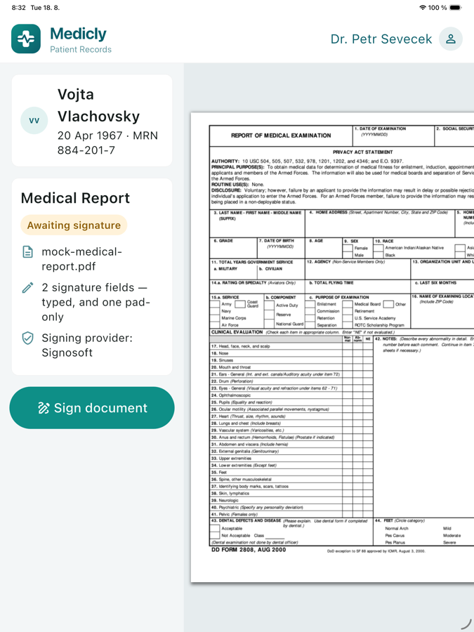

1. Two-column tablet layout, 2× text as intended for across-the-room viewing.
2. *Sign document* is present and enabled — a token was passed.

### Ceremony open inside the app
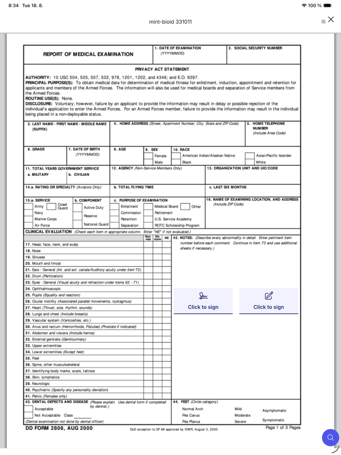

1. Full-screen, no browser chrome, no address bar — the patient never leaves the app.
2. Both fields render as *Click to sign*. The bridge reported `ready` at this point.

### Typed field — the Draw tab takes a finger-drawn signature
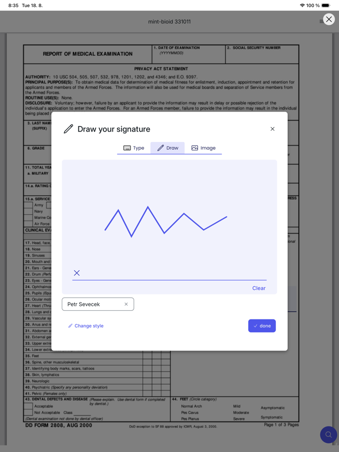

1. The `simple` field offers **Type / Draw / Image**. *Draw* is the handwritten path that works.
2. The stroke was injected as a real multi-point touch path and rendered correctly inside the WebView — so touch handling through the SDK's `WKWebView` is sound.

### Signed and stamped
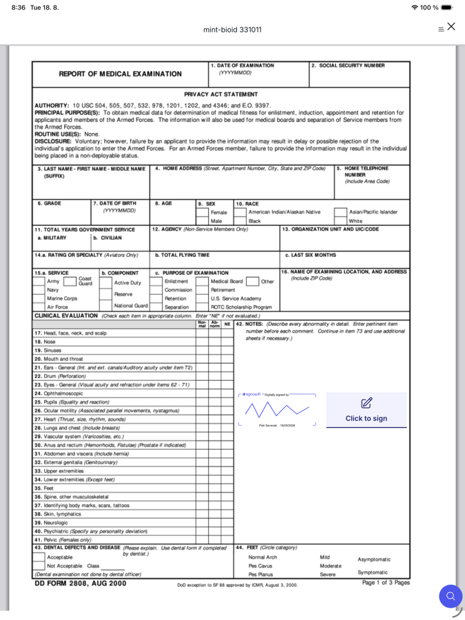

1. Signosoft frame, *Digitally signed by*, the drawn mark, name and date.
2. The right-hand field is still *Click to sign*.

### Pad-only field
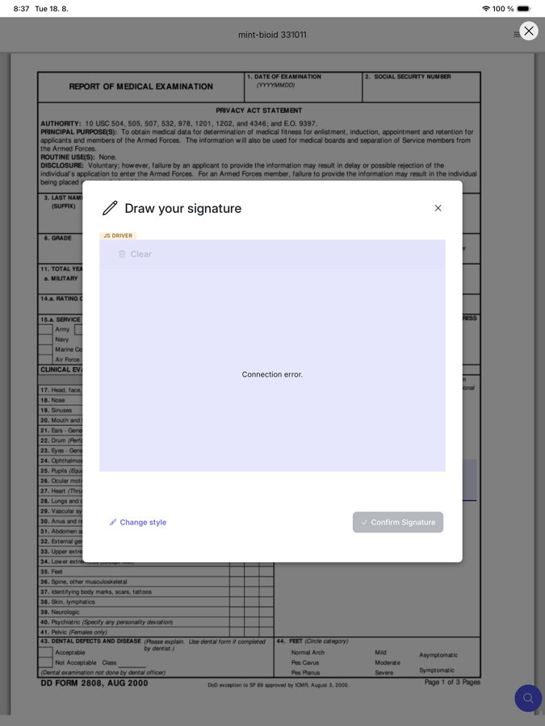

1. `JS DRIVER` badge and **"Connection error."** in place of a canvas.
2. *Confirm Signature* is disabled and cannot be enabled. Finding 2.

### No way to finalise
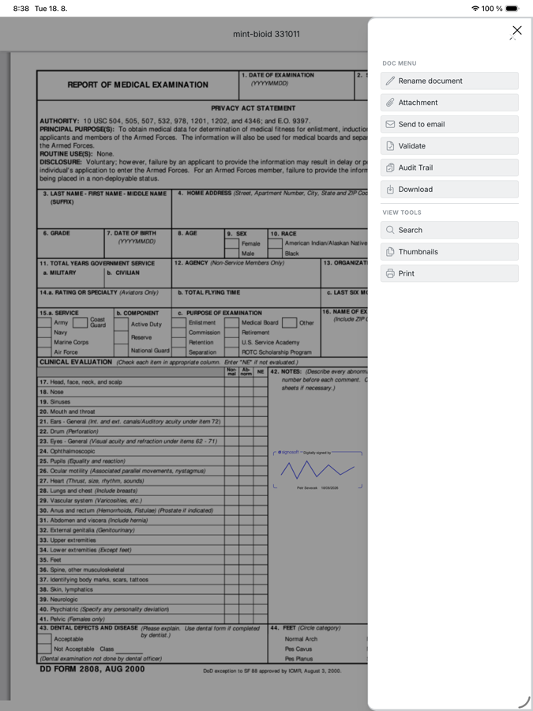

1. The whole document menu. No Finalize, no Finish, no Complete. Finding 4.

### Host app after closing
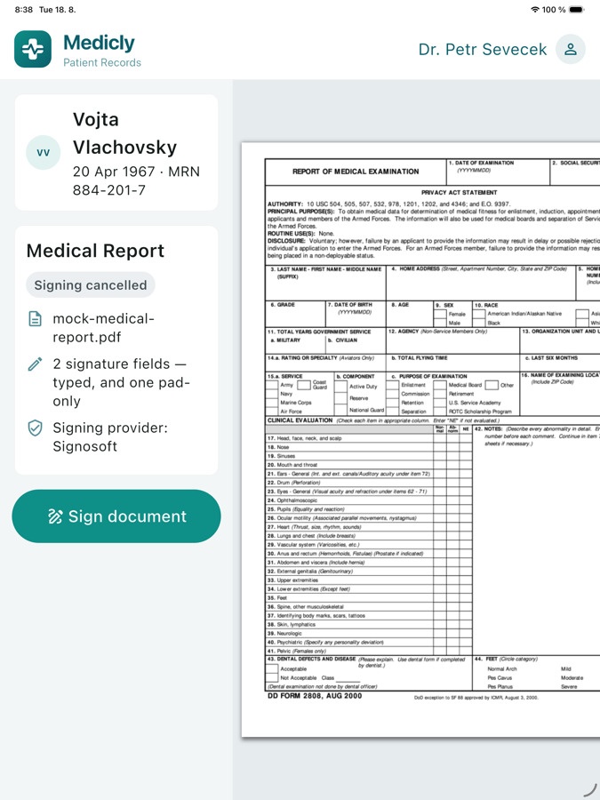

1. **"Signing cancelled"** — the SDK reported `Cancelled` correctly and promptly.
2. But one signature had already been recorded server-side. Finding 3.

### The second field refuses, even after reopening
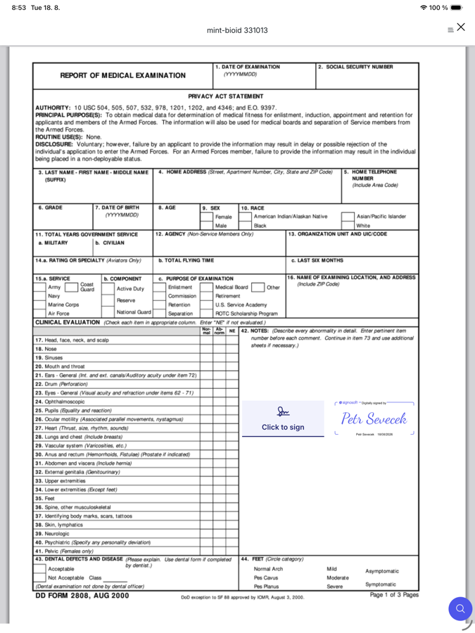

1. Right field stamped, left still *Click to sign*, in a **freshly reopened** session.
2. Server confirmed `Signature_1: sigsigned=false`. Finding 1.

### The full happy path, on a one-field document
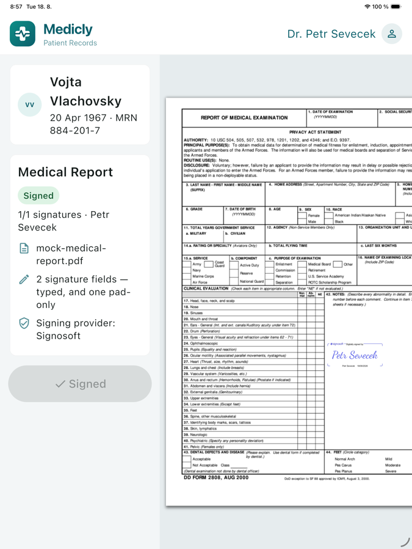

1. **Signed**, *1/1 signatures · Petr Sevecek*, button disabled at *✓ Signed*.
2. The right-hand pane is the **signed PDF**, fetched over the bridge and reopened from the app's `tmp/` directory — the stamp is embedded in the document, not drawn by the app.

The bridge event behind that screen:

```
[signosoft] SignosoftDiagnostic(signed, {
  result: success, document: 331014,
  documentToken: df2b3d17-1cc2-472c-b56d-f97eb2852fc2_1787036139937,
  signaturesSigned: 1.0, signaturesTotal: 1.0,
  lastSignerFirstName: Petr, lastSignerLastName: Sevecek,
  pdfFileName: mint-bioid 331014.pdf, pdfBase64Length: 1201756, lang: en
})
```

A 1.2 MB signed PDF crossed the bridge, was written to disk, and was reopened by
the host app.

---

## iPhone — the run

### Host app
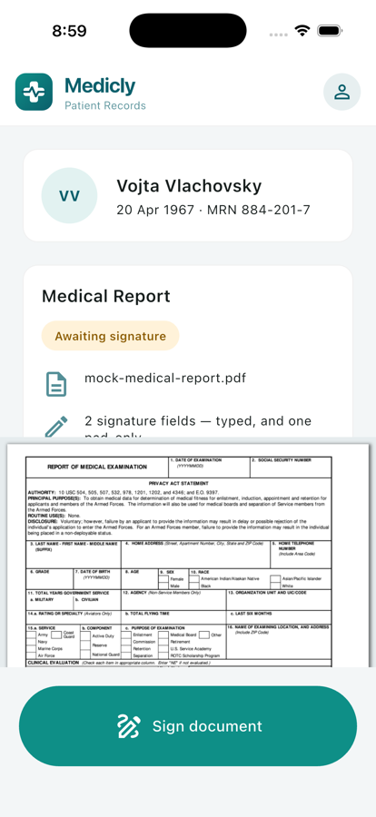

1. Phone layout: compact toolbar, avatar-only clinician chip, no overflow anywhere.
2. *Sign document* pinned at the bottom, outside the scroll area — reachable, which it was not before this month's layout fix.

### Ceremony open
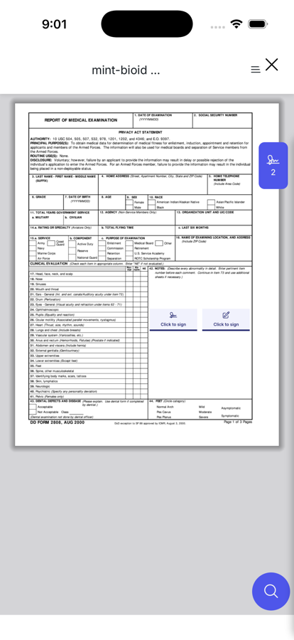

1. The shell has its own phone layout — hamburger, floating signature counter reading **2**, search as a floating button.
2. Both fields are legible and tappable at 402pt wide.

### Pad-only field — same failure
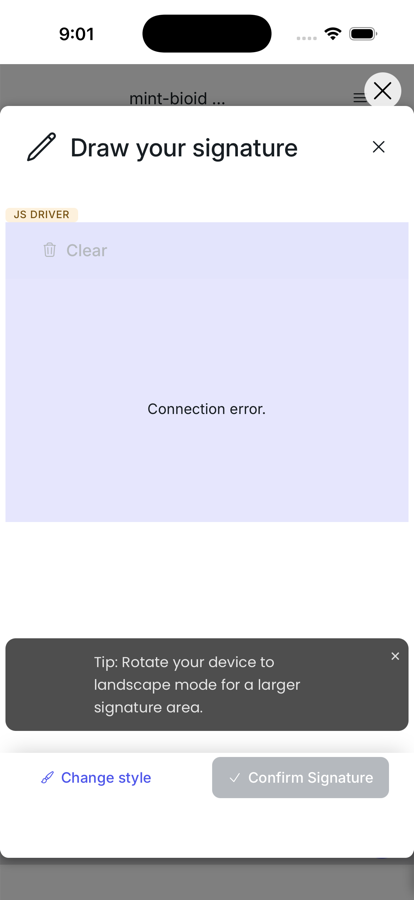

1. `JS DRIVER`, **"Connection error."**, *Confirm Signature* disabled. Identical to iPad, so nothing about it is form-factor specific.
2. The rotate-for-more-room tip shows the pad is phone-aware; it simply cannot reach a driver.

### Finger-drawn signature on the phone
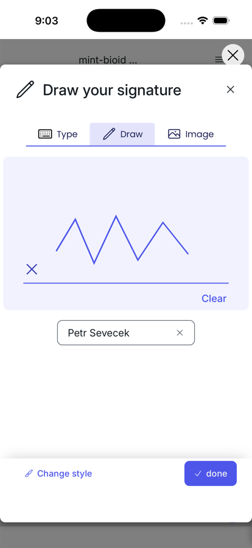

1. *Draw* tab on the `simple` field, stroke injected as a touch path, rendered correctly.
2. `done` enabled. Server then confirmed `Signature_1: sigsigned=true`.

### After signing, back in the ceremony
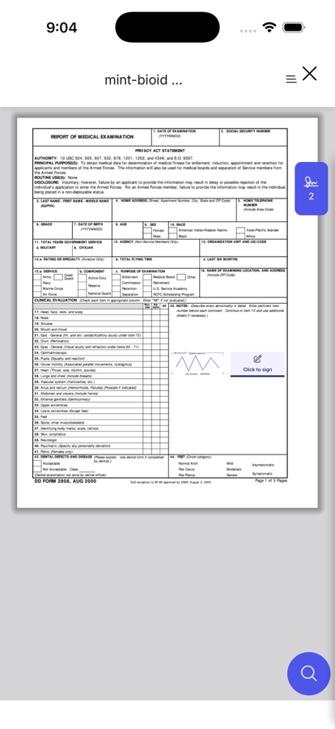

1. The state the phone was left in once the typed field was accepted.
2. The pad-only field remains unsigned and unsignable, which is why no terminal
   outcome follows on this document. Finding 1.

---

## Gates, run before the test

| Gate | Result |
|---|---|
| `cd ios && swift test` (macOS) | 14 passed |
| `xcodebuild test -destination "platform=iOS Simulator,…"` | **35 passed**, `TEST SUCCEEDED` |
| `cd signosoft_signer && flutter analyze && flutter test` | clean, 22 passed |
| `cd examples/medicly && flutter analyze && flutter test` | clean, 6 passed |
| `cd signosoft_signer/example && flutter analyze && flutter test` | clean, 5 passed |

---

## Still unverified

- **Physical hardware.** Everything above is the Simulator. A device test is set
  up and pending; the signing profile in use expires **2026-08-24**.
- **Camera-based signature methods** and the media-permission prompt — impossible
  on the Simulator.
- **`Rejected`.** The tenant reports `showPRReject: false`, so no Reject control
  is rendered and the outcome still cannot be exercised.
- **Interruption handling** — backgrounding mid-ceremony, rotation, incoming
  calls.
- **A `Signed` outcome on a multi-field document**, which finding 1 says is
  currently impossible.

---

## What would make the demo show the happy path

Not done — recorded for a decision, no code was changed:

1. **Mint a one-field document** for the demo. Proven to reach `Signed` with the
   PDF returned. Smallest possible change, entirely in `tools/mint-bioid.mjs`.
2. **Get `https://www.signosoft.com` added to the signpad licence origin
   allowlist**, which is what unblocks the pad-only field. Server-side, no SDK
   change; `docs/TODO.txt` has the request and the `curl` that proves the list.
3. **Establish whether one-signature-per-`bioid` is intended.** If a document is
   meant to carry several fields for one signer, either the backend must mint a
   token per signature or the limit is a defect.
